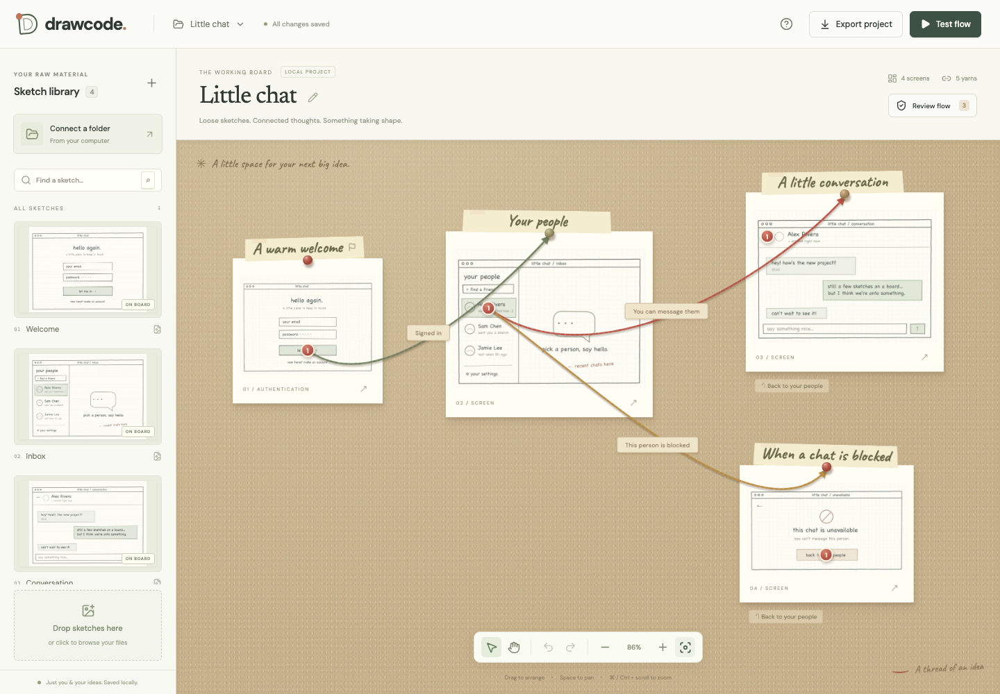

# Sketchcoded

**Ideas, connected.** A local bulletin board for turning rough UI sketches into a connected, playable app specification.

Bring image files of your sketches from your computer into a library. Plan what the app should do, pin sketches to a board, describe the interactions, and connect them with yarn. Give a screen a web drawing and a mobile drawing. Review the flow, play through the sketches, and export a project that a future implementation agent can read.



## Start

Requires Node.js **22.12 or later** and npm.

```sh
npm install
npm run dev
```

Open **http://127.0.0.1:5173**. The first launch creates the **Little chat** example with four screens, conditional chat branches, an intentional one-way login, and authored Back actions. No account, API key, or external service is needed. Fonts and images are served locally.

Stop the development server with **Ctrl+C** when finished. During agent work, servers and test browsers run only while actively needed and are closed before handoff.

For the built app:

```sh
npm run build
npm start
```

`PORT=5176 npm run dev` uses a different port. `DRAWCODE_DATA_DIR=/absolute/path npm run dev` chooses a different project storage directory. The server binds to `127.0.0.1`.

## Working with your agent

Every frame, sketch and idea has a short code (F1, S2, I3; a pin is “F3 pin 2”), shown wherever it appears, so you and your agent can point at the same thing. Every view has a **Tell the agent** button. It copies a prompt that leads with that code and names what you are looking at (the board, a frame, a pin, a yarn, an idea, a finding, a Test flow trail, the sketch library), links the task brief the running app serves for exactly that (`/api/projects/<id>/brief?…`), lists the skills to read (`/api/skills/<name>.md`) and the rules in your words (`/api/checklist.md`), and states the default task, which you can edit before pasting. Your agent reads the live board from `http://127.0.0.1:5173` and writes back through the same API, so there is no export or back-and-forth for a change to one frame; the open board picks up the agent's change by itself when you have nothing unsaved. The app opens on a landing page at `/` with your boards and a way to start one; the brand at the top left brings you back. To start a board for another project, choose **New board with your agent** there (or in the Boards menu): the prompt has the agent create the board through the local API and write its first plan; you open it from the same menu and draw. All boards live side by side in `.drawcode/`; Export keeps a copy inside a codebase. Details: `docs/AGENT_HANDOFF.md`.

## Make a flow

1. **Plan first, if you like.** Open **Planning** and write down every idea for the app: a title, details, which screen it belongs on, and where it leads. Screens you have not drawn yet can be planned as empty frames. See [Plan before you draw](#plan-before-you-draw).
2. **Bring in sketches.** Click **Connect a folder** and enter its absolute path. New and changed images appear every 20 seconds; the refresh button checks immediately. Alternatively import a folder once, choose individual files, or drop files onto the library. Images are files already on this computer.
3. **Arrange the board.** Drag a library thumbnail onto the board and give it a required title, or drop it onto a planned frame to fill that frame. Clicking a thumbnail also adds it. Drag cards to move them. Use the zoom controls, **F** to fit, or **Space + drag** to pan. Scroll zooms around the pointer; **Shift + scroll** pans. Drag blank space to pan without changing tools. The zoom slider also works with arrow keys. Browser Cmd/Ctrl zoom remains available.
4. **Describe an interaction.** Click a screen, choose **Add a pin**, and click the sketch. Give the pin a name and a description, or choose **Place** beside a planned idea so the pin is written for you. Drag an existing pin to move it. Screen details let you set its purpose, type, entry-point status, board size, and its web and mobile drawings.
5. **Tie the yarn.** From the pin editor, choose **Connect to a screen**, close to the board, and click the destination. You can also click a numbered board pin and then a card. One pin can have many yarns. Click a yarn or its label to edit the source pin, destination, short summary, condition, detailed logic, and data passed. Back and Dismiss actions are available in the pin editor and appear below the screen on the board.
6. **Review the flow.** Open **Review flow**. Locate an issue, fix it, or accept an intentional concern with a reason. Accepted decisions remain visible, travel with the export, and reopen if relevant evidence changes. Structural errors cannot be waived.
7. **Try the sketches.** Click **Test flow**. A pin with one connection follows it directly; a pin with several connections offers a scenario chooser with descriptions. You choose the condition to simulate. Switch between **Web** and **Mobile** when a screen has both drawings. Restart, change the starting screen, or rewind the test. Rewind is explicitly separate from app navigation.

**Read the app as an outline:** switch from **Board** to **App outline** for a searchable directory of screens, pins, and paths. Each screen appears once; shared destinations link to that entry. **Show on board** centers the selected sketch. Switching views preserves your board position.

**Show a closer look:** choose **Detail reference** in a pin’s **Pin purpose** field. Attach a sketch from the dropdown or choose it on the board. A regular sketch with no app connections becomes a detail sketch automatically; a screen already used in the flow keeps its role. Detail references appear as dashed olive threads and are identified in the outline. In Test flow, they open a larger illustration and return to the same app screen without advancing the test or creating a return route. You can also set **Screen type** to **Detail / enlarged sketch** for a dedicated reference.

**Find sketches already used:** each library image shows a **Used** count or **Not used yet**. Expand the count to jump to its placements. Filter the library to used or unused images. On smaller or zoomed browser windows, **Sketch library** opens the library drawer.

**Comfortable editing:** fields have consistent heights, notes expand with their text, and each dialog has one content scrollbar and a visible close button. Narrow and zoomed windows rearrange the interface; short windows allow the page to scroll so controls remain reachable.

**Undo / redo:** toolbar buttons or Cmd/Ctrl+Z / Cmd/Ctrl+Shift+Z. Deleting a screen removes its pins and incident yarns; deleting a pin removes its branches. Both are undoable. The image remains in the library.

**Boards:** the menu beside the Sketchcoded logo opens saved boards, creates a blank board or another chat example, and imports exported projects. Rename a board with its pencil button.

## Plan before you draw

**Planning** is the third view beside Board and App outline. It holds every functionality idea for the product you are designing, so the drawings can follow the plan instead of the other way round.

- **Add an idea any time.** A title, details, the screen it belongs on, and the screen it leads to. Ideas without a screen wait in a pool; each screen has a folder.
- **Plan a frame before drawing it.** Give it a title and purpose. It appears on the board as an empty dashed frame listing its ideas. Drop a sketch onto it, or choose a drawing in its editor, and it becomes a normal screen with its ideas ready to place.
- **Place an idea.** Choose **Place on the drawing**, click the spot on the sketch, and the pin is created with the idea’s name and description. If the idea leads somewhere, the yarn is tied as a draft you can refine. Until then, the planned connection is listed in the plan and in the text outline; the board draws only real yarn.
- **Nothing lands twice.** Placed ideas stay in the list, greyed out with their pin number. Moving a placed idea to another screen removes its pin, undoably, so it can be placed again.
- **Talk about it.** **Copy as text** or **Show as text** gives a markdown outline with `[x]` placed, `[ ]` waiting, and `( )` unassigned markers plus the planned threads. The same outline is included in every export’s `flow.md`, so a conversation about the plan and the exported specification use the same words.

## Web and mobile layouts

A screen can hold two drawings of the same view. In the screen editor, choose a **Web drawing** and a **Mobile drawing** from the library; both appear side by side. Pins are placed on the web drawing first. Each pin can then be placed on the mobile drawing too, from the strip under it or from the pin’s **Mobile layout** section. Pins not yet on mobile are a waivable review finding. Yarn is authored once per pin and applies to both layouts. On the board, a card with a mobile drawing shows a small phone thumbnail. In Test flow, switch between **Web** and **Mobile**; pins not yet on the mobile drawing are listed under it so no path is lost. Exports describe both drawings and both positions.

## The workstation

The left column holds the **sketch library** in two sections, **New** and **Used**; a sketch moves to Used the moment it lands on a frame. Below it, the **Ideas** panel lists what is still left to do, grouped by screen; click an idea to place it. The **Plan** tab holds the full planning view, where ideas are added and edited.

On the board, drag a frame’s corner to **resize** it, and look for the small house on the frame where the app starts. Pins carry one of four **colors**; in the pin editor, pick the color and write what it means on this board, and the legend appears under the pins list.

In the screen editor, switch between the **Web** and **Mobile** drawings above the image. The pins list on the right moves or deletes a pin in one click and highlights the selected pin on the image.

## Links out

A pin that leaves the app for a web address is a **link pin**. Choose **Link out** as its purpose and write the address in its description, with any conditions in plain words. That is all: no yarn, no destination frame. The board shows link pins with a dashed ring, Test flow reports where the link would go, and Review flow asks for an address if none is written. Never model an external site as a screen.

## Navigation that means something

Each connection has an explicit navigation action:

| Action          | Behavior in the preview                                                           |
| --------------- | --------------------------------------------------------------------------------- |
| Open screen     | Push the destination onto app history.                                            |
| Replace current | Replace only the current history entry.                                           |
| Start fresh     | Clear history and open the destination; useful after login.                       |
| Open as dialog  | Remember the actual caller and open a modal frame.                                |
| Go back         | Pop app history; report an unavailable action when no prior frame exists.         |
| Dismiss         | Close the current dialog and any pages nested inside it, returning to its caller. |

Screen types describe intent. A login label does **not** automatically excuse a one-way path. An intentional ending needs an explanation. Alternate entry points are supported. A screen can represent a reusable view, with context such as `conversationId` passed by a connection.

Checks detect broken references, missing images in the graph, missing titles/intent, unconnected pins, missing entries, unreachable screens, dead ends, possible one-way paths, uncertain history contexts, duplicate branch summaries, multiple fallbacks, natural-language branching that needs review, planned frames waiting for a drawing (unless the frame is left to the AI), pins missing from a mobile layout, link pins without an address, and yarn attached to a link pin.

A structural return path can be indirect. Conversely, a cycle does not prove that prose conditions permit a return in every state. The checker distinguishes hard structural errors from concerns that need judgment. See [the graph contract](docs/GRAPH.md) for the precise limits.

## Your files and the future workflow

Projects auto-save after a short pause. The status beside the board menu reports whether changes have reached disk. Unsaved edits trigger a browser leave warning. Each save uses an atomic file replacement and keeps the previous version as a backup. Concurrent saves from another tab cause a visible conflict; the app does not overwrite the other tab’s work.

```text
.drawcode/
  projects/<project-id>.json      # Current board and graph
  projects/<project-id>.json.bak  # Previous saved version
  assets/<sha256>.webp           # Immutable image snapshots
```

Source folders are read only. Source changes create new library versions; screens already on the board retain their selected snapshot and pin positions. Moving or deleting source images does not break saved boards. Disconnecting a folder stops refreshing it and keeps the imported images.

**Export project** downloads a `.sketchcoded.zip` containing:

- `project.json`: the versioned canonical graph, layout, library, planning backlog, layouts, and review decisions.
- `schema.json`: the JSON Schema for the project format.
- `flow.md`: the same specification organized by screen, pin, branch, planning backlog, and review finding for a human or future agent.
- `review.json`: current findings, acceptance status, and recorded reasons.
- `assets/`: all the project’s normalized image snapshots.
- `BUILD-CHECKLIST.md`: the user’s rules for anything built from the board, dated and in their words.
- `READ-ME.md`: a guide to reading the bundle.

The Sketchcoded name keeps the existing `.drawcode/` storage directory and client identifiers so saved boards continue working. Older `.drawcode.zip` bundles still import. Local source-folder paths are omitted. Importing a bundle creates a separate board, validates the graph and image hashes, and never replaces an existing board. Export uses the current in-memory project, so it can rescue unsaved edits after a two-tab conflict while the server is running.

The agentic generation and review workflow is intentionally deferred, as requested in the original brief. No natural-language condition is executed and no code is generated from the board yet.

## Limits and recovery

- Designed for desktop browsers, with a compact layout for smaller windows. Images are files already on this computer; there is no phone capture or upload from a phone. Mouse/trackpad authoring is the main interaction; file selection and add buttons provide alternatives to dragging.
- A screen needs a web drawing before pins can be placed. The mobile drawing adds a second position for each pin; it does not hold pins of its own.
- Dialogs keep a fixed size and scroll inside. Nothing on screen grows or shrinks because of what was clicked. Wherever content continues off screen, a “More below” pill and a visible scrollbar say so.
- Supported input: PNG, JPEG, WebP, GIF, AVIF, TIFF, and SVG. Animated or multipage images use the first frame/page. Images are oriented correctly, stripped of source metadata, and normalized to WebP at a maximum of 4096 pixels per side. Keep originals if you need their original format or resolution.
- Images: 25 MB each, 40 per upload batch. Folder sync: up to 500 images, 5,000 entries, and eight nested levels per folder; hidden files and symlinks are skipped. The UI reports skipped/unreadable files during manual import or refresh.
- ZIP import: 150 MB compressed / 250 MB expanded. Projects support up to 500 screens, 5,000 pins, 10,000 connections, and 2,000 assets within the 8 MB JSON request limit.
- The local server must be running to save, refresh folders, or export. If it stops, restart it; the visible save-error bar offers retry. Keep the tab open until it reports saved. There is no offline service worker or cloud sync.
- For a two-tab conflict, export the unsaved work, reload the tab, then import that export as a separate board if needed.
- If a project JSON is damaged, stop the server and copy its `.json.bak` over the damaged `.json`, keeping a separate copy of both first. If an asset is missing from `.drawcode/assets`, restore it from a project ZIP or filesystem backup. Source-file deletion alone does not cause this.
- Undo history is session-local. Saved review decisions and their reasons persist; resolved decisions remain available in the review history.
- There is no automatic asset garbage collection. Keeping snapshots avoids losing images that may still be needed by another board or a backup.

## Development and verification

```sh
npm test                  # Graph, navigation, planning, persistence, API, and bundle tests
npm run build             # TypeScript and production build
npx playwright install chromium
npm run test:ui           # Real browser authoring and preview workflows
npm run format:check      # Formatting
```

Browser tests include actual Chromium tab zoom at 125%, 150%, 200%, and 250%, using a test-only extension under `tests/fixtures/zoom-extension/`. The extension is loaded only in an isolated temporary test browser.

Browser tests start an isolated built server on port 5174 and store their boards under `.drawcode/ui-tests/`. Run `npm run build` before them. The application on port 5173 and its projects are kept separate.

The shared graph, navigation and planning code has no React or server dependency. `server/` handles local images and persistence; `src/components/` contains the board, library, planning view, editors, review panel, and preview. Original demo sketches are code-authored in `server/demo-art.ts`.

- [Original product brief](docs/ORIGINAL_BRIEF.md)
- [Acceptance and verification checklist](docs/PROGRESS.md)
- [Current usability pass](docs/USABILITY_PASS.md)
- [Planning pass: backlog, planned frames, layouts](docs/PLANNING_PASS.md)
- [What Sketchcoded can do](docs/FUNCTIONALITY.md)
- [Build checklist for agents](docs/BUILD_CHECKLIST.md)
- [Development decisions](docs/DECISIONS.md)
- [Graph format and checker semantics](docs/GRAPH.md)

Implementation references: [Vite’s server API](https://vite.dev/guide/api-javascript.html), [React effects](https://react.dev/reference/react/useEffect), and [Sharp’s image operations](https://sharp.pixelplumbing.com/api-operation/).
